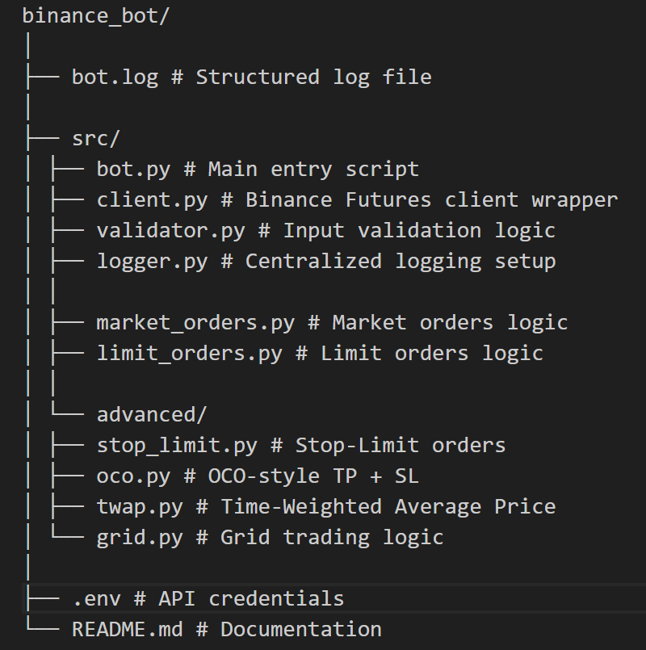
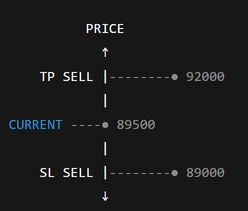

# BinanceFutures Trading Bot (CLI Based)

# **📌 Overview**

- **This project is a command-line trading bot developed in Python for Binance USDT-M Futures (Testnet).**
  It implements both core order types and advanced execution workflows, with a strong focus on input validation, structured logging, modular architecture, and risk-aware design.

- **The system is engineered as an order execution framework rather than a profit-seeking strategy engine, emphasizing reliability, correctness, and safe testing practices.**

# **🎯 Key Objectives**

- **Demonstrate Binance Futures API expertise**  
  Show practical understanding of USDT-M Futures order mechanics and execution flows.

- **Build production-style modular architecture**  
  Separate concerns using reusable client, validation, and logging layers.

- **Implement strong validation and error handling**  
  Prevent invalid trades and ensure graceful failure handling.

- **Develop advanced order execution logic**  
  Support Stop-Limit, OCO, TWAP, and Grid trading workflows.

- **Ensure safe testing via Binance Futures Testnet**  
  All operations run in a sandbox environment with zero financial risk.

# **🧱 Project Architecture**

<p align="center">
  
</p>

# **🔑 Technology Stack**

<div align="center">

| Component   | Technology              |
| ----------- | ----------------------- |
| Language    | Python 3.x              |
| API         | Binance Futures API     |
| SDK         | python-binance          |
| Logging     | logging module          |
| CLI         | argparse                |
| Environment | Binance Futures Testnet |

</div>
<br>

# **🔐 Environment Setup**

## 1) Create Virtual Environment:

```bash
    python -m venv venv
    source venv/bin/activate   # Linux / macOS
    venv\Scripts\activate      # Windows
```

## 2) Install Dependencies:

```bash
   pip install -r requirements.txt
```

## 3) Configure API Keys:

### Create .env file:

```bash
    BINANCE_API_KEY=your_testnet_key
    BINANCE_API_SECRET=your_testnet_secret
```

<br>

# **📊 Logging System:**

All trading actions executed by the bot are automatically recorded in a structured log file named `bot.log`.

- **The logging system is designed to provide full traceability, debugging visibility, and execution transparency — essential qualities for any trading infrastructure.**

### Each log entry includes:

- **Timestamp** — the exact time the action occurred
- **Log level** — severity indicator (`INFO`, `WARNING`, `ERROR`)
- **Message** — details about the operation (order placement, status, or failure)

<br>

## Log Format:

YYYY- MM - DD HH : MM : SS | LEVEL | Message

### Example:

```bash
    2026-01-28 22:10:15 | INFO | Placing MARKET order | BTCUSDT | BUY | 0.01
```

<br>

# **📘 USER GUIDE**

## Market Orders:

### Purpose

- **Execute an order immediately at the best available market price.  
  Market orders prioritize **speed of execution** over price precision, making them suitable for urgent entries or exits where immediate fill is more important than exact pricing.**

### Command

```bash
python src/bot.py BTCUSDT MARKET BUY 0.01
```

<br>
<div align="center">

| Argument       | Description                            |
| -------------- | -------------------------------------- |
| `<symbol>`     | Futures trading pair (e.g., `BTCUSDT`) |
| `<order_type>` | Order type (`MARKET` / `LIMIT`)        |
| `<side>`       | Order direction (`BUY` / `SELL`)       |
| `<quantity>`   | Amount to trade                        |

</div>
<br>

## Limit Orders:

### Purpose

- **Execute an order only at a specified price or better.  
  Limit orders provide **price control**, allowing traders to define acceptable entry or exit levels instead of accepting the current market price.**

### Command

```bash
python src/bot.py BTCUSDT LIMIT BUY 0.01 --price 43000


```

<br>
<div align="center">

| Parameter | Description           |
| --------- | --------------------- |
| `BTCUSDT` | Futures trading pair  |
| `LIMIT`   | Order type            |
| `BUY`     | Order side (BUY/SELL) |
| `0.01`    | Quantity in BTC       |
| `--price` | Limit execution price |

</div>
<br>

## Stop-Limit Orders:

### Purpose

- **Provide risk control using a trigger price and a predefined execution price.  
  Stop-Limit orders help automate protective exits or breakout entries by activating only when a specified market condition is met.**

### Command

```bash
python bot.py BTCUSDT STOP_LIMIT BUY 0.01 --price 43000 --stop 42900
```

<br>
<div align="center">

| Parameter       | Meaning               |
| --------------- | --------------------- |
| `BTCUSDT`       | Futures trading pair  |
| `STOP_LIMIT`    | Order type            |
| `BUY`           | Order side (BUY/SELL) |
| `0.01`          | Quantity in BTC       |
| `--price 43000` | Limit execution price |
| `--stop 42900`  | Trigger price         |

</div>
<br>

## OCO (One-Cancels-the-Other):

### Purpose

- **Execute a simultaneous Take-Profit and Stop-Loss exit strategy.  
  OCO-style orders allow automated risk management by placing two opposing exit conditions, ensuring the position closes when either profit target or protection level is reached.**

### Command

```bash
python src/bot.py BTCUSDT OCO SELL 0.01 --tp 45000 --stop 42000

```

<br>
<div align="center">

|   Parameter    | Meaning                                   |
| :------------: | :---------------------------------------- |
|   `BTCUSDT`    | Futures trading pair (symbol)             |
|     `OCO`      | Order type (One-Cancels-the-Other)        |
|     `SELL`     | Exit side of the position                 |
|     `0.01`     | Quantity to close (position size in BTC)  |
|  `--tp 45000`  | Take-profit price (target exit level)     |
| `--stop 42000` | Stop trigger price (stop-loss activation) |

</div>
<br>

## OCO Logic Diagram

<p align="center">
  
</p>

- **When one order executes, the other is cancelled automatically by position closure.**

## TWAP (Time-Weighted Average Price):

### Purpose

- **Reduce market impact by splitting a large order into smaller time-distributed executions.  
  TWAP (Time-Weighted Average Price) spreads the trade across intervals to minimize slippage and improve execution stability.**

### Command

```bash
python src/bot.py BTCUSDT TWAP BUY 0.03 --parts 3 --interval 5

```

<div align="center">

| Parameter      | Meaning                                  |
| -------------- | ---------------------------------------- |
| `BTCUSDT`      | Futures trading pair                     |
| `TWAP`         | Order type (Time-Weighted Average Price) |
| `BUY`          | Order side (BUY/SELL)                    |
| `0.03`         | Total quantity to execute                |
| `--parts 3`    | Number of split orders                   |
| `--interval 5` | Time gap between orders (seconds)        |

</div>
<br>

### Execution Flow:

```bash
    Total Qty → Split → Execute → Wait → Execute → ...
```

<br>

## Grid Trading:

### Purpose

- **Automate buy-low and sell-high behavior within a predefined price range.  
  Grid trading places layered limit orders to capture volatility in sideways markets through systematic price intervals.**

### Command

```bash
python src/bot.py BTCUSDT GRID BUY 0.03 --price 43000
```

<div align="center">

| Parameter       | Description               |
| --------------- | ------------------------- |
| `BTCUSDT`       | Futures trading pair      |
| `GRID`          | Order type                |
| `BUY`           | Order side (BUY/SELL)     |
| `0.03`          | Total grid quantity       |
| `--price 43000` | Base grid execution price |

</div>
<br>

# ⚠️ Risk & Design Considerations

- **This trading bot operates in high-volatility futures markets and uses automated execution strategies.
  Each component introduces specific operational and financial risks that must be understood before deployment.
  The table below summarizes key risks associated with the system design.**

<div align="center">

| Feature         | Risk                      |
| --------------- | ------------------------- |
| Futures Trading | Leverage & liquidation    |
| Grid Strategy   | Performs poorly in trends |
| Testnet         | Low liquidity             |
| TWAP            | Time-dependent execution  |

</div>
<br>

## ✅ Design Decisions

- **The project is intentionally built to run exclusively on the Binance Futures Testnet to ensure a safe, risk-free development environment.  
  A modular architecture is used to separate client access, validation, logging, and execution logic, improving maintainability and extensibility.**

- **Validation and logging are centralized to guarantee consistent behavior across all order types and to simplify debugging.  
  The system avoids unnecessary over-engineering and focuses on correctness, clarity, and reliability.**

- **The primary emphasis is on robust execution logic rather than speculative trading strategy, positioning the bot as an execution framework instead of a profit-seeking algorithm.**

<br>

## 📌 Conclusion

- **This project demonstrates a strong practical understanding of Binance Futures mechanics and execution workflows.  
  It showcases a clean, production-style code structure with modular components designed for scalability and maintainability.**

- **The implementation highlights the ability to build advanced order execution systems while maintaining disciplined validation, logging, and error handling.  
  It also reflects responsible risk management by operating entirely within a controlled testnet environment.**

